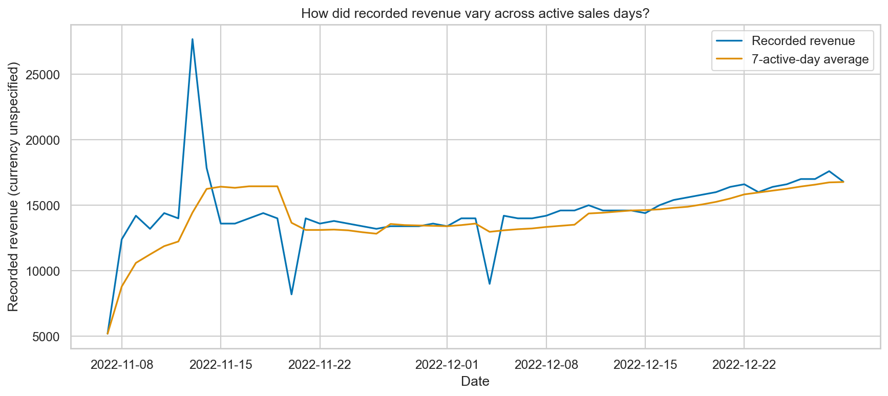
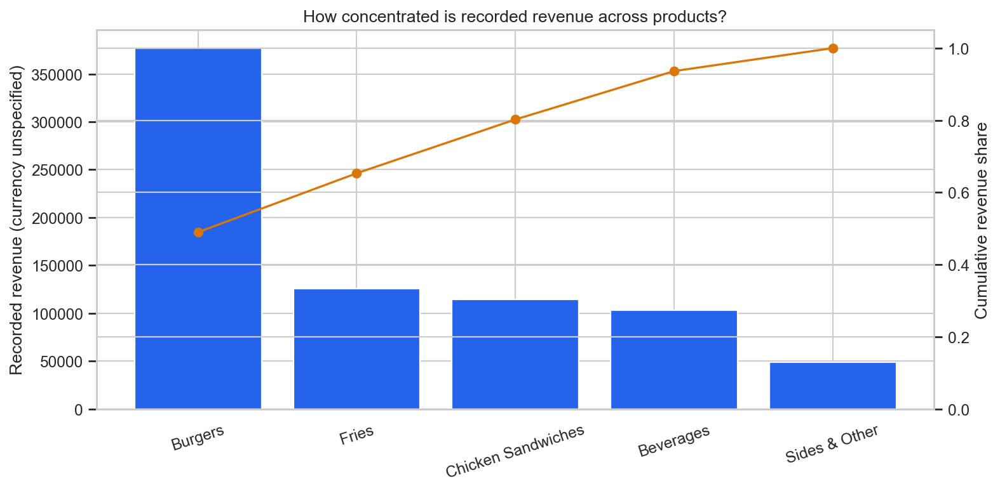
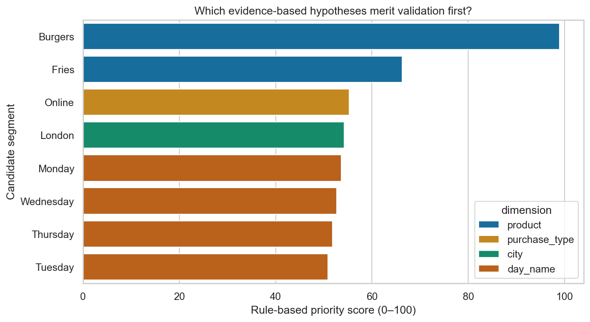

# Restaurant Performance Intelligence

> Diagnosing where recorded restaurant revenue is concentrated—and which questions deserve a closer look.

## Project Snapshot

This dataset looks simple until its grain is examined: each row is an aggregated product-sales record, not a verified customer order. Treating the source `order_id` as an order count would produce misleading AOV and basket metrics, so those KPIs are deliberately excluded. Instead, the project investigates how recorded quantity, weighted selling price, menu mix, location, channel, payment method, and time appear alongside revenue. The result is a traceable view of concentration and performance patterns that helps narrow the next business questions without overstating what the source can prove.

| Recorded revenue | Sales records | Recorded quantity | Weighted selling price | Active sales days |
|---:|---:|---:|---:|---:|
| 769,515.89 | 254 | 116,995.31 | 6.58 | 53 |

Currency and quantity units are not specified in the source.

## Visual Preview

### Revenue across active sales days



Daily revenue varies across the extract, while the rolling average gives a clearer view of the underlying direction without treating two partial months as a clean growth comparison.

### Menu concentration



Three products account for 80.2% of recorded revenue, making menu concentration a more useful question than a simple best-seller ranking.

### Questions to validate first



The priority matrix turns descriptive patterns into a review queue; its scores rank evidence to investigate, not expected financial impact.

## What I Found

- Burgers contribute 49.0% of recorded revenue, almost three times the share of Fries at 16.3%. The menu is therefore more dependent on one product than the ranking alone suggests.
- Lisbon and London contribute 31.4% and 27.4% respectively, or 58.9% combined. Location coverage and mix should be examined before interpreting that gap as operational performance.
- Online is the largest purchase type at 39.7% of revenue, but its weighted selling price is 6.23 versus 6.58 overall. Product mix and price realization are the next useful checks.
- Credit Card represents 47.0% of recorded revenue, ahead of Cash at 31.1%. This describes the tender mix in the extract rather than an individual customer preference.

## Business Question

**Which factors are observed alongside recorded restaurant revenue, where is performance concentrated, and which areas present the clearest evidence-based questions for further validation?**

## Dataset and Analytical Grain

The source is the Kaggle dataset `rohitgrewal/restaurant-sales-data`, containing 254 records from 7 November to 29 December 2022. The defensible grain is **one aggregated product-sales record with a unique source `order_id`**. Large fractional quantities do not support interpreting a row as a customer order or a conventional item-level transaction.

The pipeline preserves the raw input, parses dates and numeric fields explicitly, standardizes category values, removes only verified exact duplicates, and exports separate audit, removed-record, and flagged-record files. Every cleaned row receives a stable `record_id`. See the [data-quality report](reports/data_quality/data_quality_report.md) and [grain analysis](reports/data_quality/data_grain_analysis.md).

## How the Analysis Works

The core decomposition is:

```text
Recorded Revenue = Recorded Quantity × Weighted Selling Price
```

The same measures are then compared across:

- daily, weekly, monthly, weekday, and weekend periods;
- products, categories, Pareto contribution, and portfolio position;
- cities, purchase types, and payment methods;
- manager coverage, presented without unadjusted performance labels;
- rule-based opportunity candidates with evidence, hypotheses, limitations, and next checks.

Metric definitions and their supported grain are documented in the [KPI guide](docs/KPI_GUIDE.md).

## Dashboard

The Streamlit dashboard keeps the analysis in five focused tabs:

1. **Executive Overview** — headline measures and the active-day revenue trend.
2. **Revenue Drivers** — quantity and weighted-price comparisons by dimension.
3. **Menu Intelligence** — product ranking, Pareto concentration, and portfolio position.
4. **Business Explorer** — filters for city, manager, payment, purchase type, category, and date.
5. **Opportunity Matrix** — evidence-backed questions and the validation required before action.

See the [dashboard guide](docs/DASHBOARD_GUIDE.md) for interpretation details.

## SQL and Data Model

Seven ordered MySQL 8.0-style scripts cover schema setup, quality checks, executive metrics, time, menu, location/channel, manager context, and opportunity candidates. Dashboard-ready exports use one small fact table with date, product, location, and channel dimensions—not a claim of a production warehouse. See the [SQL guide](docs/SQL_GUIDE.md) and [BI data model](docs/BI_DATA_MODEL.md).

## Run Locally

Python 3.11 or newer is supported.

```bash
python -m venv .venv
python -m pip install -r requirements-dev.txt
python run_pipeline.py
streamlit run app.py
```

For Windows PowerShell activation and Docker instructions, use the [reproducibility](docs/REPRODUCIBILITY.md) and [deployment](docs/DEPLOYMENT.md) guides.

## Engineering Quality

Synthetic tests run without Kaggle, MySQL, Power BI, network access, or credentials. Ruff, coverage enforcement, pre-commit hooks, GitHub Actions, Docker configuration, schema checks, artifact reconciliation, and README link checks are included. The latest automated status and check inventory are available in the [project validation report](reports/validation/project_validation.md); testing details live in [docs/TESTING.md](docs/TESTING.md).

## Repository Map

```text
app.py              Streamlit dashboard
config/             Product taxonomy mapping
data/               Preserved raw source
docs/               Focused usage and interpretation guides
notebook/           Executed analytical walkthrough
output/             Analysis, BI tables, figures, insights, and KPIs
reports/            Quality, validation, findings, and limitations
sql/                Ordered analytical SQL scripts
src/                Reusable pipeline and validation logic
tests/              Deterministic synthetic tests
```

## Limitations

- Currency and quantity units are unspecified.
- Customer identifiers and verified order-line structure are unavailable, so Total Orders, AOV, basket size, retention, and customer segmentation are unsupported.
- Costs, discounts, tax, inventory, staffing, traffic, and capacity are absent; recorded revenue cannot measure financial contribution or operational efficiency.
- Both months are partial periods, and the historical extract may not describe current operations.
- Manager, location, channel, payment, and menu comparisons are descriptive; the data does not establish causal effects.

## Design Decisions

- I left order KPIs blank instead of relabeling source records as customer orders.
- I decomposed revenue into recorded quantity and weighted selling price because both components are directly supported by the available fields.
- I framed opportunities as validation questions so the evidence, uncertainty, and next data requirement remain visible together.

## Next Questions

- How do product contribution and channel mix change when verified transaction and discount fields are available?
- Which menu items remain attractive after item costs, waste, and stockouts are included?
- Do the location and weekday patterns persist across complete, more recent periods?
- Which opportunity hypotheses survive a controlled pilot or comparable-group design?
